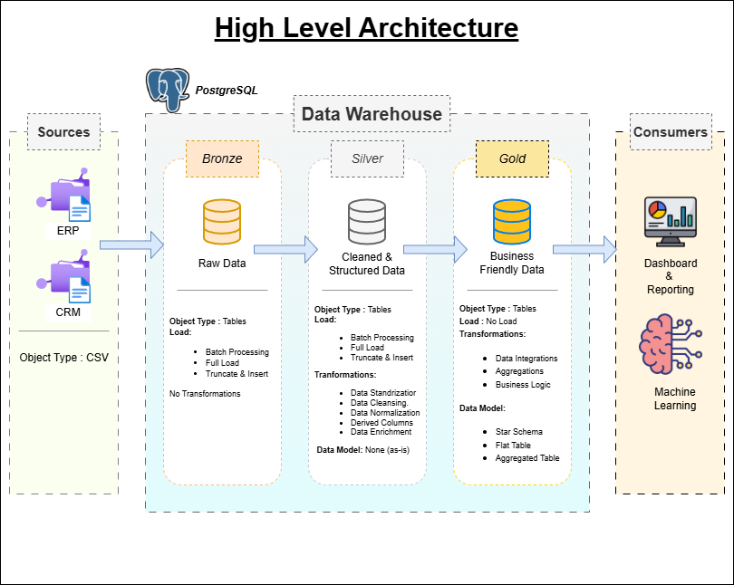
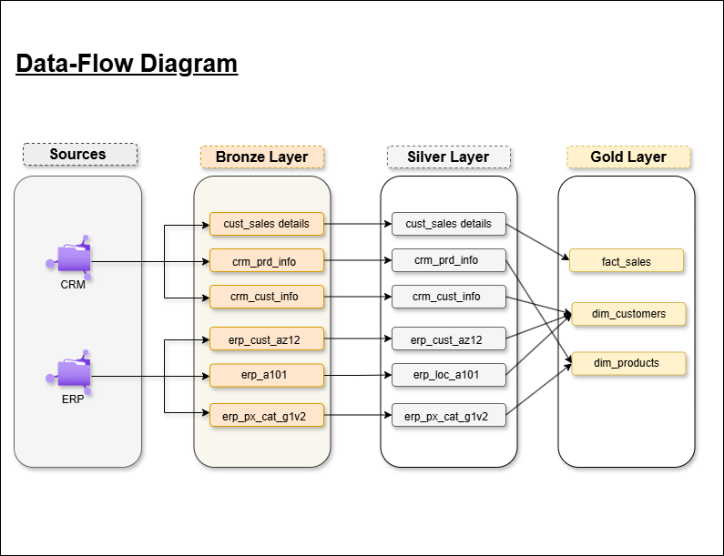
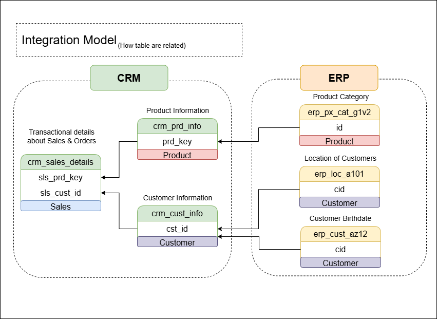
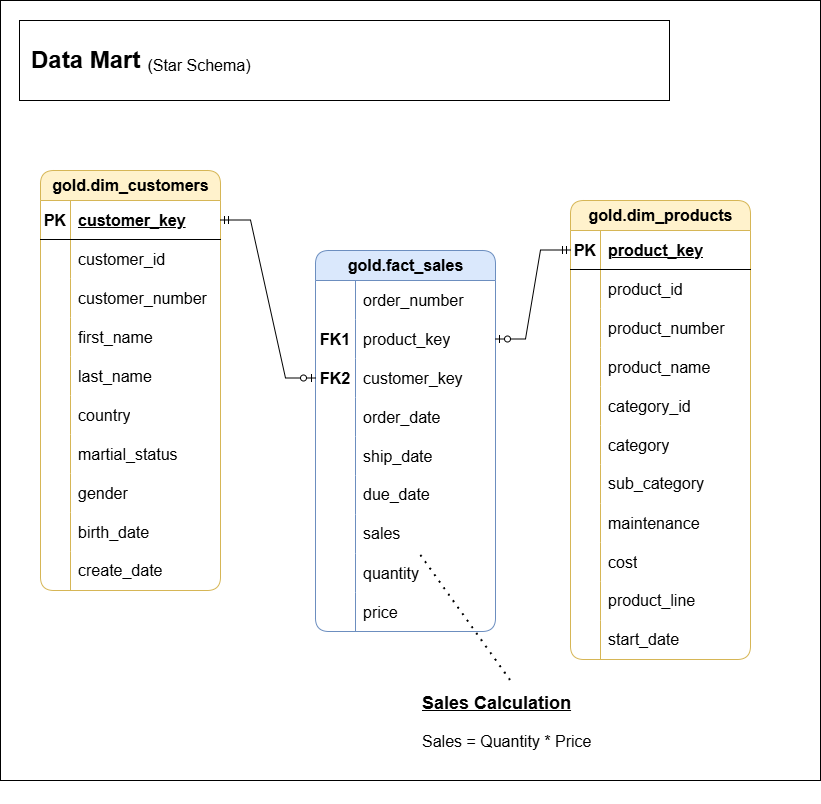

# 🏗️ SQL Data Warehouse — End-to-End ETL Pipeline

[](https://www.postgresql.org/)
[](#-architecture)
[](LICENSE)

> **A production-grade data warehouse implementation featuring a Medallion Architecture (Bronze → Silver → Gold), multi-source data integration, and a dimensional Star Schema — built entirely in SQL on PostgreSQL.**

---

## 📋 Table of Contents

- [Project Overview](#-project-overview)
- [Architecture](#-architecture)
- [Data Sources](#-data-sources)
- [Data Flow](#-data-flow)
- [Data Integration Model](#-data-integration-model)
- [Data Model — Star Schema](#-data-model--star-schema)
- [ETL Pipeline](#-etl-pipeline)
- [Data Quality Framework](#-data-quality-framework)
- [Repository Structure](#-repository-structure)
- [Documentation](#-documentation)
- [Getting Started](#-getting-started)
- [Key Features](#-key-features)
- [Future Enhancements](#-future-enhancements)

---

## 🎯 Project Overview

This project implements a **modern analytical data warehouse** that consolidates data from two heterogeneous enterprise systems — a **CRM** (Customer Relationship Management) platform and an **ERP** (Enterprise Resource Planning) system — into a unified, query-optimized data mart for business intelligence and reporting.

### Business Objective

Enable data-driven decision making by:
- Integrating fragmented customer, product, and sales data across systems
- Cleansing and standardizing inconsistent source data
- Building a dimensional model optimized for analytical queries
- Providing a single source of truth for sales performance analysis

### Scope

| Metric | Detail |
|---|---|
| **Source Systems** | 2 (CRM + ERP) |
| **Source Tables** | 6 |
| **Customer Records** | ~18,400 |
| **Product Records** | ~397 |
| **Warehouse Layers** | 3 (Bronze → Silver → Gold) |
| **Target Database** | PostgreSQL 16 |
| **Data Model** | Star Schema (1 Fact + 2 Dimensions) |

---

## 🏛️ Architecture

The warehouse follows the **Medallion Architecture** pattern, organizing data into three progressive layers of refinement within PostgreSQL schemas:



| Layer | Schema | Purpose | Object Type |
|---|---|---|---|
| **Bronze** | `bronze` | Raw data ingestion — exact copy of source | Tables |
| **Silver** | `silver` | Cleansed, standardized, deduplicated data | Tables |
| **Gold** | `gold` | Business-ready dimensional model | Views |

---

## 📦 Data Sources

### CRM System (`datasets/source_crm/`)

| File | Description | Records | Key Fields |
|---|---|---|---|
| `cust_info.csv` | Customer master data | ~18,400 | Customer ID, name, gender, marital status |
| `prd_info.csv` | Product catalog | ~397 | Product key, name, cost, product line |
| `sales_details.csv` | Sales transactions | — | Order number, dates, quantity, price |

### ERP System (`datasets/source_erp/`)

| File | Description | Records | Key Fields |
|---|---|---|---|
| `CUST_AZ12.csv` | Customer demographics | ~18,400 | Customer ID, birth date, gender |
| `LOC_A101.csv` | Customer locations | ~18,400 | Customer ID, country |
| `PX_CAT_G1V2.csv` | Product categories | 37 | Category ID, category, subcategory |

---

## 🔄 Data Flow

The diagram below traces every table from source ingestion through each warehouse layer to the final dimensional model:



**Flow Summary:**
```
CRM (3 files) ──► Bronze (3 tables) ──► Silver (3 tables) ──┐
                                                              ├──► Gold (2 Dims + 1 Fact)
ERP (3 files) ──► Bronze (3 tables) ──► Silver (3 tables) ──┘
```

---

## 🔗 Data Integration Model

The CRM and ERP systems share no native integration. This project establishes cross-system linkage by mapping join keys between source tables:



**Key Relationships:**
- `crm_cust_info.cst_key` ↔ `erp_cust_az12.cid` (after stripping the `NAS` prefix)
- `crm_cust_info.cst_key` ↔ `erp_loc_a101.cid`
- `crm_prd_info.prd_key` → extracted `cat_id` ↔ `erp_px_cat_g1v2.id`
- `crm_sales_details.sls_prd_key` ↔ `crm_prd_info.prd_key`
- `crm_sales_details.sls_cust_id` ↔ `crm_cust_info.cst_id`

---

## ⭐ Data Model — Star Schema

The Gold layer implements a classic **Star Schema** optimized for analytical queries, with a central fact table surrounded by conformed dimension tables:



### `gold.dim_customers`

| Column | Source | Description |
|---|---|---|
| `customer_key` | Generated | Surrogate key (ROW_NUMBER) |
| `customer_id` | CRM | Natural business identifier |
| `customer_number` | CRM | Alphanumeric customer code |
| `first_name` | CRM | Cleaned first name |
| `last_name` | CRM | Cleaned last name |
| `country` | ERP | Customer country |
| `marital_status` | CRM | Standardized (Single / Married / n/a) |
| `gender` | CRM + ERP | CRM preferred, ERP as fallback |
| `birth_date` | ERP | Customer date of birth |
| `create_date` | CRM | Account creation date |

### `gold.dim_products`

| Column | Source | Description |
|---|---|---|
| `product_key` | Generated | Surrogate key (ROW_NUMBER) |
| `product_id` | CRM | Natural product identifier |
| `product_number` | CRM | Extracted product number |
| `product_name` | CRM | Cleaned product name |
| `category_id` | CRM | Extracted category identifier |
| `category` | ERP | Product category name |
| `sub_category` | ERP | Product subcategory |
| `maintenance` | ERP | Maintenance flag (Yes / No) |
| `cost` | CRM | Product unit cost |
| `product_line` | CRM | Standardized product line |
| `start_date` | CRM | Product availability date |

### `gold.fact_sales`

| Column | Source | Description |
|---|---|---|
| `order_number` | CRM | Sales order number |
| `product_key` | Gold Dim | FK to `dim_products` |
| `customer_key` | Gold Dim | FK to `dim_customers` |
| `order_date` | CRM | Date of sale |
| `ship_date` | CRM | Shipment date |
| `due_date` | CRM | Payment due date |
| `sales` | CRM | Total sales amount |
| `quantity` | CRM | Units sold |
| `price` | CRM | Unit price |

> **Sales Calculation:** `sales = quantity × price`

---

## ⚙️ ETL Pipeline

### Execution Order

```
1. scripts/init_database.sql        → Create database and schemas
2. scripts/bronze/ddl_bronze.sql    → Create Bronze layer tables
3. scripts/bronze/load_bronze.sql   → Ingest raw CSV data
4. scripts/silver/ddl_silver.sql    → Create Silver layer tables
5. scripts/silver/load_silver.sql   → Transform and load cleansed data
6. scripts/gold/ddl_gold.sql        → Create Gold layer views
7. tests/quality_checks_silver.sql  → Validate Silver layer data quality
8. tests/quality_checks_gold.sql    → Validate Gold layer data quality
```

### Bronze Layer — Raw Ingestion

- **Method:** PostgreSQL `COPY` command (bulk CSV import)
- **Strategy:** Full truncate-and-reload
- **Transformations:** None — data is stored as-is from source
- **Implementation:** `bronze.load_bronze()` stored procedure with per-table timing and error handling

### Silver Layer — Cleansing & Standardization

| Transformation | Example |
|---|---|
| **Deduplication** | `ROW_NUMBER()` to keep latest customer record |
| **String Cleaning** | `TRIM()` on all name fields |
| **Code Standardization** | `'M'` → `'Married'`, `'F'` → `'Female'` |
| **Null Handling** | `COALESCE(prd_cost, 0)` for missing costs |
| **Key Extraction** | Split composite `prd_key` into `cat_id` + `prd_key` |
| **SCD Type 2 Logic** | `LEAD()` window function to compute product end dates |
| **Date Conversion** | Integer dates (`20250101`) cast to `DATE` type |
| **ID Normalization** | Strip `NAS` prefix from ERP customer IDs |

### Gold Layer — Business-Ready Views

- Joins Silver tables across CRM and ERP systems
- Generates surrogate keys via `ROW_NUMBER()`
- Resolves data conflicts (e.g., gender: CRM value preferred, ERP as fallback)
- Filters to current product versions (`WHERE prd_end_dt IS NULL`)
- Implemented as **views** for always-fresh query results

---

## 🛡️ Data Quality Framework

### Silver Layer Checks (`tests/quality_checks_silver.sql`)

20 structured validation queries covering:

| Check Category | Description | Checks |
|---|---|---|
| **Duplicate Detection** | Primary key uniqueness | #1, #5 |
| **NULL Validation** | Required field completeness | #1, #5, #7 |
| **Whitespace Validation** | Untrimmed string detection | #2, #3, #6, #19 |
| **Standardization Checks** | Valid domain values | #4, #8, #20 |
| **Date Validation** | Invalid / future / out-of-range dates | #9, #11–#14, #18 |
| **Business Rule Validation** | Logical consistency | #7, #9, #14, #15 |
| **Data Consistency** | `sales = quantity × price` | #15, #16 |
| **Referential Integrity** | Cross-system key matching | #17 |
| **SCD Validation** | End date calculation accuracy | #10 |

### Gold Layer Checks (`tests/quality_checks_gold.sql`)

- Dimension surrogate key uniqueness
- Fact-to-dimension referential integrity (orphan record detection)
- Gender value domain validation

---

## 📁 Repository Structure

```
DataWareHouse_Project_with_SQL/
│
├── datasets/                           # Raw source data files
│   ├── source_crm/                     # CRM system exports
│   │   ├── cust_info.csv               #   Customer master data
│   │   ├── prd_info.csv                #   Product catalog
│   │   └── sales_details.csv           #   Sales transactions
│   └── source_erp/                     # ERP system exports
│       ├── CUST_AZ12.csv               #   Customer demographics
│       ├── LOC_A101.csv                #   Customer locations
│       └── PX_CAT_G1V2.csv            #   Product categories
│
├── scripts/                            # ETL pipeline scripts
│   ├── init_database.sql               # Database & schema creation
│   ├── bronze/                         # Bronze layer (raw ingestion)
│   │   ├── ddl_bronze.sql              #   Table definitions
│   │   └── load_bronze.sql             #   CSV → Bronze load procedure
│   ├── silver/                         # Silver layer (cleansing)
│   │   ├── ddl_silver.sql              #   Table definitions
│   │   └── load_silver.sql             #   Bronze → Silver transformations
│   └── gold/                           # Gold layer (presentation)
│       └── ddl_gold.sql                #   Star Schema view definitions
│
├── tests/                              # Data quality validation
│   ├── quality_checks_silver.sql       # 20 Silver layer checks
│   └── quality_checks_gold.sql         # Gold layer integrity checks
│
├── docs/                               # Architecture, design & documentation
│   ├── Architecture.png                # High-level system architecture
│   ├── Data-Flow.png                   # Table-level data flow
│   ├── Integration_Model.png           # Cross-system integration map
│   ├── Data_mart.png                   # Star Schema ER diagram
│   ├── data_catalog.md                 # Enterprise data catalog
│   └── naming_conventions.md           # Naming standards guide
│
└── README.md                           # Project documentation
```

---

## 📚 Documentation

| Document | Description |
|---|---|
| [Data Catalog](docs/data_catalog.md) | Complete data dictionary — every table, column, transformation, and business usage across all three layers |
| [Naming Conventions](docs/naming_conventions.md) | Enterprise naming standards for schemas, tables, columns, keys, procedures, and files |

---

## 🚀 Getting Started

### Prerequisites

- **PostgreSQL 16+** installed and running
- A SQL client (pgAdmin, DBeaver, psql CLI, or VS Code with SQLTools)
- Sufficient permissions to create databases and schemas

### Setup Instructions

**Step 1 — Create the Database and Schemas**

```sql
-- Connect to the 'postgres' database, then run:
-- ⚠️ WARNING: This will drop an existing 'datawarehouse' database
\i scripts/init_database.sql
```

**Step 2 — Create and Load the Bronze Layer**

```sql
-- Connect to the 'datawarehouse' database, then run:
\i scripts/bronze/ddl_bronze.sql
\i scripts/bronze/load_bronze.sql
```

> **Note:** Update the file paths in `load_bronze.sql` to match your local dataset directory before running.

**Step 3 — Create and Load the Silver Layer**

```sql
\i scripts/silver/ddl_silver.sql
\i scripts/silver/load_silver.sql
```

**Step 4 — Create the Gold Layer Views**

```sql
\i scripts/gold/ddl_gold.sql
```

**Step 5 — Run Data Quality Checks**

```sql
\i tests/quality_checks_silver.sql
\i tests/quality_checks_gold.sql
```

---

## ✨ Key Features

| Feature | Description |
|---|---|
| **Medallion Architecture** | Three-layer data refinement pipeline (Bronze → Silver → Gold) |
| **Multi-Source Integration** | Consolidation of CRM and ERP data into a unified model |
| **Stored Procedures** | Automated ETL with execution logging and error handling |
| **Data Quality Checks** | 20+ validation queries covering completeness, accuracy, and consistency |
| **Star Schema** | Dimensional model with surrogate keys, optimized for BI tools |
| **SCD Type 2** | Slowly Changing Dimension logic for product version history |
| **Data Cleansing** | Deduplication, trimming, null handling, and code standardization |

---

## 🔮 Future Enhancements

- [ ] Add incremental / CDC-based loading (replace full truncate-reload)
- [ ] Build a Python orchestration layer (`psycopg2` / Airflow DAG)
- [ ] Add a logging/audit table to track ETL run history
- [ ] Connect to a BI tool (Power BI / Tableau) for dashboard visualizations
- [ ] Implement row-level data quality scoring
- [ ] Add automated regression tests with expected result assertions
- [ ] Containerize with Docker for one-command setup

---

<div align="center">

**Built with PostgreSQL · Designed for Analytics · Open for Contributions**

</div>